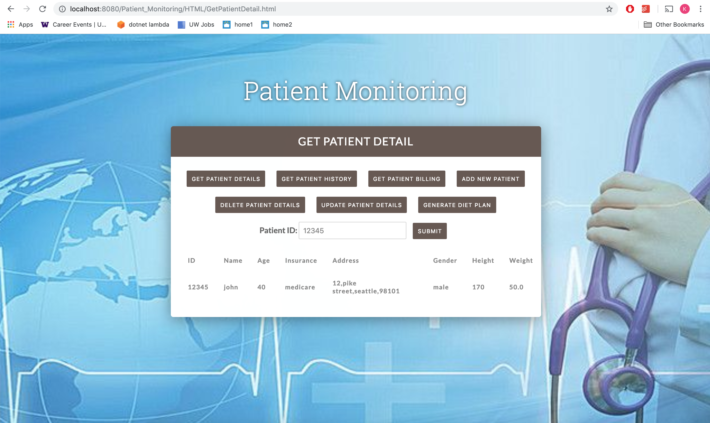
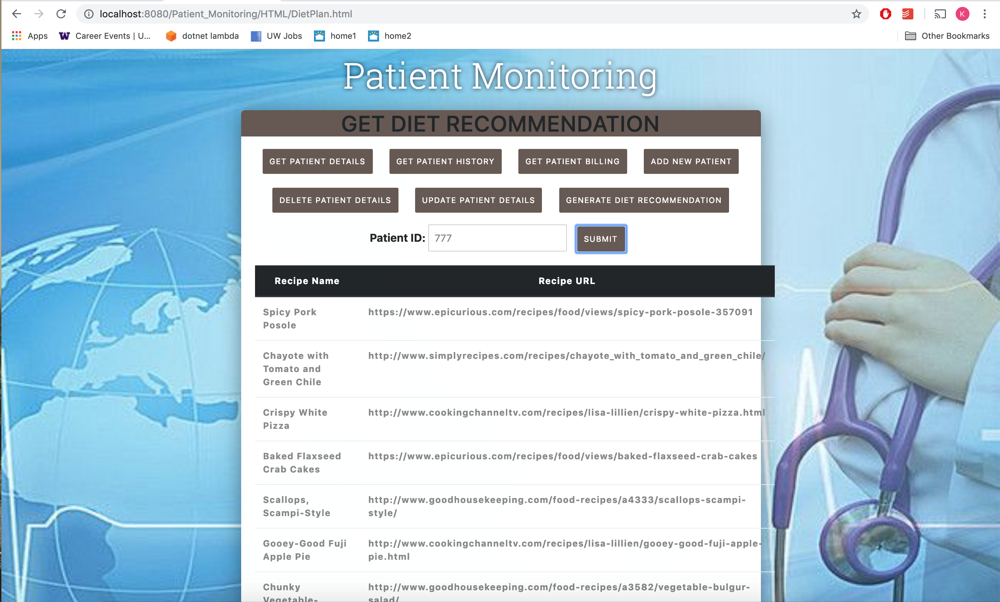

## Patient Monitoring  - Web application
Patient Monitoring is a sample web application for patient management using RFID. Every patient will be given a unique RFID. Using this RFID the 
patient vital signs are monitored and can be tracked. All functionalities in the application is implemented as 
web service using Java jersey client. HTML and Jquery are used in the front end and Jersey client for web service implementation 
and MySQL database is used 
at backend. 

## Website

## List of web services:

### Web services implemented
1.Get patient details by RFID.
2.Add new patient details.
3.Update existing patient using RFID.
4.Delete existing patient using RFID.
5.Get patient history by RFID.
6.GET billing details by patient's RFID.

### External Web services
1. Twilio SMS notification service : Patient vital signs are monitored continuously and if their vital signs are not in the normal range
then care taker of the patient (doctor/nurse) will be notified immediately with the reason. Example message will be patient id 12345 is critical. His respiration rate is high.
2.Get Diet Recommendation service: It consumes two external service. Depending on the patient id all his details will be 
obtained using get patient details by RFID service. The first service will calculate the BML depending on the patient age,gender, 
height and weight. We are finding the calorie type based on the result of BMI calculator.The second service will provide a list of
recipe names and url's depending upon the input calorie type.

## How to execute
To run the application :
prerequisite softwares
Apache Tomcat 7
java 1.8
MySQL

## Deployment Steps:
1.copy the PatientMonitoring.war from warfile folder to tomcat webappfolder or get the code from git in local machine
2.start tomcat and go to http://localhost:8080/Patient_Monitoring/HTML/LoginForm.html to run our application
3.login page will open. login your details to go to the site
4.after login, home page will be displayed where the list of operation that user can do, is listed
5.user can use all the menu available to get or add new details.

